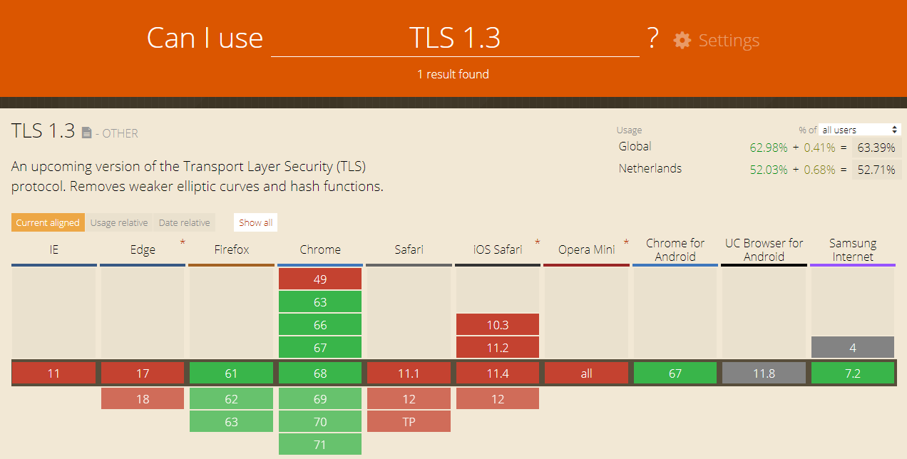
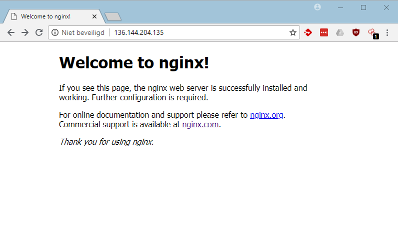
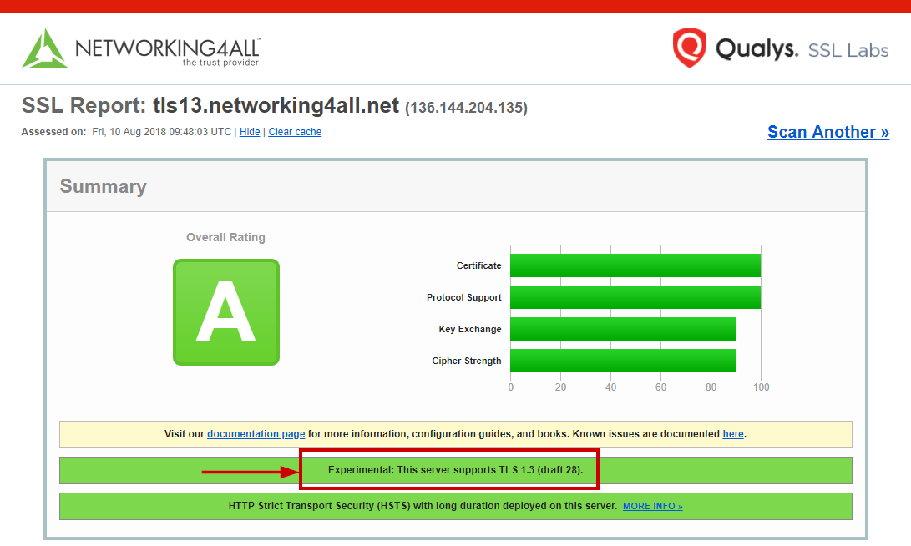

# Aan de slag met TLS 1.3

In maart 2018 heeft de IETF (Internet Engingeering Task Force) de ontwikkelingen van TLS versie 1.3 afgerond. Dit houd in dat TLS 1.3 klaar is voor gebruik. Nu is het dus de beurt aan de makers van software om TLS 1.3 te gaan ondersteunen en aan de gebruiker om dit ook echt te gaan gebruiken. Dit kan nog wel een obstakel worden gezien het feit dat TLS 1.2 al beschikbaar was in 2008 (10 jaar geleden dus) en nog steeds niet overal in gebruik genomen is.

## Wat is er anders aan TLS 1.3

Er zijn veel zaken veranderd in TLS 1.3. Zo zijn er onveilige zaken geschrapt zoals de "statische ciphers" van RSA en heeft men er voor gezorgd dat er een round trip minder nodig is waardoor de website sneller moet laden. Dit is mogelijk doordat de client tijdens de eerste `client hello` gelijk een `key share` mee stuurt. Dit waren voorheen 2 losse stappen.

Zaken als [TLS false start](https://blogs.windows.com/msedgedev/2016/06/15/building-a-faster-and-more-secure-web-with-tcp-fast-open-tls-false-start-and-tls-1-3/) en Zero Round Trip Time (0-RTT) zijn  allemaal opgenomen in TLS 1.3.

Zero Round Trip Time (0-RTT) is de methode waarbij  TLS 1.3 het session ticket (PSK) van een eerder bezochte webserver onthoud waarbij we NOG een round-trip over kunnen slaan.

Wat is er uit TLS 1.3 gehaald:

* static RSA handshake. Dit is nu (EC)DHE
* CBC MtE mode. Dit is nu AEAD
* RC4
* SHA1, MD5
* DES, 3DES
* Compression
* Renegotiation

Zaken die vereenvoudigd zijn:

* DHE groups
* RSASSA-PSS
* AEAD Nonce-Disrespecting Adversaries
* Session Tickets & ID's. Dit is nu Ticket + PSK

Toegevoegd:

* Full handshake signature
* Fallback / downgrade protection
* Ratcheted resumption with (EC)DHE
* Curve 25519 en 448

Door al deze aanpassingen zijn vulnerabilities zoals LogJam, Freak, CRIME, SLOTH, DROWN, Poodle, Lucky13 niet meer van toepassing. Wel zijn we uiteraard benieuwd welke nieuwe vulnerabilities TLS versie 1.3 met zich mee gaat nemen. Ook worden nu met TLS versie 1.3 de nieuwere versleutelingsmethoden geforceerd.

## Beperkte ondersteuning

Doordat TLS versie 1.3 nog niet op veel plaatsen geimplementeerd is, zullen niet veel mensen en diensten je website kunnen bezoeken. Hierdoor is het erg wenselijk om een ook een ouder protocol te ondersteunen. Door de `ssl_protocols` configuratie optie uit te breiden met TLSv1.2 zoals de regel hier onder, is deze website al gelijk voor een veel groter publiek toegankelijk.

```text
ssl_protocols TLSv1.2 TLSv1.3;
```

De website [caniuse.com](https://caniuse.com/#search=TLS%201.3) heeft een overzicht van browsers die TLS versie 1.3 onderstuenen. Dit zijn er op dit moment nog niet veel.



Wilt u zelf TLS versie 1.3 testen, vind u hier onder een korte installatie handleiding van Nginx met TLS 1.3 aan via OpenSSL met "draft 28".

## Installatie Nginx met TLS 1.3 ondersteuning

Omgeving:

* Nieuwe Ubuntu 18.04 installatie
* Nginx 1.15.2
* OpenSSL
* Certificaat (in mijn geval een EC 384 bits)

Installatie van handige tools met apt

```bash
apt install git wget curl vim build-essential
```

Ik maak een temp directory aan voor de software die ik nodig heb om de nginx webserver te compilen.

```bash
mkdir /root/temp
cd /root/temp
```

Hierna download ik de benodigde software

```
wget https://nginx.org/download/nginx-1.15.2.tar.gz
wget https://ftp.pcre.org/pub/pcre/pcre-8.42.tar.gz
wget http://www.zlib.net/zlib-1.2.11.tar.gz
```

En ik clone OpenSSL vanaf Github

```bash
git clone https://github.com/openssl/openssl.git
```

Ik pak de boel uit, en gooi daarna mijn download bestand weg.

```bash
tar xfz nginx-1.15.2.tar.gz
rm nginx-1.15.2.tar.gz
tar xfz pcre-8.42.tar.gz
rm pcre-8.42.tar.gz
tar xfz zlib-1.2.11.tar.gz
rm zlib-1.2.11.tar.gz
```

Hierna ga ik naar de nginx bron directory

```bash
cd nginx-1.15.2
```

Vanuit hier start ik het bouw proces van Nginx. Bekijk [hier de  opties](http://nginx.org/en/docs/configure.html) van het `configure` commando.

Let op dat de paden goed staan voor als je een andere structuur aan wil houden.

```bash
./configure --prefix=/usr/share/nginx \
            --sbin-path=/usr/sbin/nginx \
            --modules-path=/usr/lib/nginx/modules \
            --conf-path=/etc/nginx/nginx.conf \
            --error-log-path=/var/log/nginx/error.log \
            --http-log-path=/var/log/nginx/access.log \
            --pid-path=/run/nginx.pid \
            --lock-path=/var/lock/nginx.lock \
            --user=www-data \
            --group=www-data \
            --build=Sebastian \
            --http-client-body-temp-path=/var/lib/nginx/body \
            --http-fastcgi-temp-path=/var/lib/nginx/fastcgi \
            --http-proxy-temp-path=/var/lib/nginx/proxy \
            --http-scgi-temp-path=/var/lib/nginx/scgi \
            --http-uwsgi-temp-path=/var/lib/nginx/uwsgi \
            --with-openssl-opt=enable-tls1_3 \
            --with-openssl=../openssl \
            --with-openssl-opt=enable-ec_nistp_64_gcc_128 \
            --with-openssl-opt=no-nextprotoneg \
            --with-openssl-opt=no-weak-ssl-ciphers \
            --with-openssl-opt=no-ssl3 \
            --with-pcre=../pcre-8.42 \
            --with-pcre-jit \
            --with-zlib=../zlib-1.2.11 \
            --with-compat \
            --with-file-aio \
            --with-threads \
            --with-http_addition_module \
            --with-http_auth_request_module \
            --with-http_dav_module \
            --with-http_flv_module \
            --with-http_gunzip_module \
            --with-http_gzip_static_module \
            --with-http_mp4_module \
            --with-http_random_index_module \
            --with-http_realip_module \
            --with-http_slice_module \
            --with-http_ssl_module \
            --with-http_sub_module \
            --with-http_stub_status_module \
            --with-http_v2_module \
            --with-http_secure_link_module \
            --with-mail \
            --with-mail_ssl_module \
            --with-stream \
            --with-stream_realip_module \
            --with-stream_ssl_module \
            --with-stream_ssl_preread_module \
            --with-debug \
            --with-cc-opt='-g -O2 -fPIE -fstack-protector-strong -Wformat -Werror=format-security -Wdate-time -D_FORTIFY_SOURCE=2' \
            --with-ld-opt='-Wl,-Bsymbolic-functions -fPIE -pie -Wl,-z,relro -Wl,-z,now'
```

Na dit configuratie commando komt er een summary in beeld.

```
Configuration summary
  + using threads
  + using PCRE library: ../pcre-8.42
  + using OpenSSL library: ../openssl
  + using zlib library: ../zlib-1.2.11

  nginx path prefix: "/usr/share/nginx"
  nginx binary file: "/usr/sbin/nginx"
  nginx modules path: "/usr/lib/nginx/modules"
  nginx configuration prefix: "/etc/nginx"
  nginx configuration file: "/etc/nginx/nginx.conf"
  nginx pid file: "/run/nginx.pid"
  nginx error log file: "/var/log/nginx/error.log"
  nginx http access log file: "/var/log/nginx/access.log"
  nginx http client request body temporary files: "/var/lib/nginx/body"
  nginx http proxy temporary files: "/var/lib/nginx/proxy"
  nginx http fastcgi temporary files: "/var/lib/nginx/fastcgi"
  nginx http uwsgi temporary files: "/var/lib/nginx/uwsgi"
  nginx http scgi temporary files: "/var/lib/nginx/scgi"
```

Hierna kunnen we verder gaan.

```bash
make
make install
```

Bekijk hierna ter controle de versie en andere informatie van Nginx.

```bash
nginx -V

nginx version: nginx/1.15.2 (Sebastian)
built by gcc 7.3.0 (Ubuntu 7.3.0-16ubuntu3)
built with OpenSSL 1.1.1-pre9-dev  xx XXX xxxx
TLS SNI support enabled
configure arguments: --prefix=/usr/share/nginx --sbin-path=/usr/sbin/nginx --modules-path=/usr/lib/nginx/modules --conf-path=/etc/nginx/nginx.conf --error-log-path=/var/log/nginx/error.log --http-log-path=/var/log/nginx/access.log --pid-path=/run/nginx.pid --lock-path=/var/lock/nginx.lock --user=www-data --group=www-data --build=Sebastian --http-client-body-temp-path=/var/lib/nginx/body --http-fastcgi-temp-path=/var/lib/nginx/fastcgi --http-proxy-temp-path=/var/lib/nginx/proxy --http-scgi-temp-path=/var/lib/nginx/scgi --http-uwsgi-temp-path=/var/lib/nginx/uwsgi --with-openssl-opt=enable-tls1_3 --with-openssl=../openssl --with-openssl-opt=enable-ec_nistp_64_gcc_128 --with-openssl-opt=no-nextprotoneg --with-openssl-opt=no-weak-ssl-ciphers --with-openssl-opt=no-ssl3 --with-pcre=../pcre-8.42 --with-pcre-jit --with-zlib=../zlib-1.2.11 --with-compat --with-file-aio --with-threads --with-http_addition_module --with-http_auth_request_module --with-http_dav_module --with-http_flv_module --with-http_gunzip_module --with-http_gzip_static_module --with-http_mp4_module --with-http_random_index_module --with-http_realip_module --with-http_slice_module --with-http_ssl_module --with-http_sub_module --with-http_stub_status_module --with-http_v2_module --with-http_secure_link_module --with-mail --with-mail_ssl_module --with-stream --with-stream_realip_module --with-stream_ssl_module --with-stream_ssl_preread_module --with-debug --with-cc-opt='-g -O2 -fPIE -fstack-protector-strong -Wformat -Werror=format-security -Wdate-time -D_FORTIFY_SOURCE=2' --with-ld-opt='-Wl,-Bsymbolic-functions -fPIE -pie -Wl,-z,relro -Wl,-z,now'
```

Test tevens de standaard configuratie van Nginx. In eerste instantie gaf Nginx bij mij een fout. Dit kwam doordat ik vergeten was een pad aan te maken.

```bash
nginx -t

nginx: the configuration file /etc/nginx/nginx.conf syntax is ok
nginx: [emerg] mkdir() "/var/lib/nginx/body" failed (2: No such file or directory)
nginx: configuration file /etc/nginx/nginx.conf test failed
```

Door het pad aan te maken en de test nog eens uit te voeren lijkt de test geslaagd.

```bash
mkdir /var/lib/nginx
nginx -t

nginx: the configuration file /etc/nginx/nginx.conf syntax is ok
nginx: configuration file /etc/nginx/nginx.conf test is successful
```

Om Nginx als een service te laten draaien, moeten we ook een service bestand aanmaken voor systemd.

```bash
vim /etc/systemd/system/nginx.service
```

Zet hier de volgende inhoud in:

```text
[Unit]
Description=Nginx webserver high performance webserver and proxy
Documentation=https://nginx.org/en/docs/
After=network.target

[Service]
Type=forking
PIDFile=/run/nginx.pid
ExecStartPre=/usr/sbin/nginx -t -q -g 'daemon on; master_process on;'
ExecStart=/usr/sbin/nginx -g 'daemon on; master_process on;'
ExecReload=/usr/sbin/nginx -g 'daemon on; master_process on;' -s reload
ExecStop=-/sbin/start-stop-daemon --quiet --stop --retry QUIT/5 --pidfile /run/nginx.pid
TimeoutStopSec=5
KillMode=mixed

[Install]
WantedBy=multi-user.target
```

Zet de Nginx service standaard aan en start deze.

```bash
systemctl enable nginx.service
systemctl start nginx.service
```

Kijk hierna of deze gestart is.

```bash
systemctl status nging

● nginx.service - Nginx webserver high performance webserver and proxy
   Loaded: loaded (/etc/systemd/system/nginx.service; enabled; vendor preset: enabled)
   Active: active (running) since Fri 2018-08-10 10:40:44 CEST; 6s ago
     Docs: https://nginx.org/en/docs/
  Process: 24565 ExecStart=/usr/sbin/nginx -g daemon on; master_process on; (code=exited, status=0/SUCCESS)
  Process: 24564 ExecStartPre=/usr/sbin/nginx -t -q -g daemon on; master_process on; (code=exited, status=0/SUCCESS)
 Main PID: 24566 (nginx)
    Tasks: 2 (limit: 1116)
   CGroup: /system.slice/nginx.service
           ├─24566 nginx: master process /usr/sbin/nginx -g daemon on; master_process on;
           └─24567 nginx: worker process

Aug 10 10:40:44 tls13 systemd[1]: Starting Nginx webserver high performance webserver and proxy...
Aug 10 10:40:44 tls13 systemd[1]: nginx.service: Failed to parse PID from file /run/nginx.pid: Invalid argument
Aug 10 10:40:44 tls13 systemd[1]: Started Nginx webserver high performance webserver and proxy.
```

Als de webserver gestart is, kunnen we met de browser deze bezoeken.



## HTTPS met TLS versie 1.3 instellen

Om wat orde te brengen in de configuratie bestanden van nginx haal ik uit de `/etc/nginx/nginx.conf` over het algemeen de `server{}` configuratie uit het `http{}` gedeelte en voeg hier de regel `include /etc/nginx/conf.d/*.conf;` aan toe waar ik mijn eigen configuratie zet voor bijvoorbeeld de websites.

```bash
vim /etc/nginx/conf.d/tls13.conf
```

Hier heb ik de volgende configuratie in staan. Let op de paden van de root en de certificaten. Deze kunnen in een andere situatie natuurlijk anders zijn.

```
# tls13 server configuration
#
server {
    listen 80 default_server;
    listen [::]:80 default_server;

    # Redirect all HTTP requests to HTTPS.
    return 301 https://$host$request_uri;
}

server {
    listen 443 ssl http2 default_server;
    listen [::]:443 ssl http2 default_server;

    ssl_certificate /etc/ssl/tls13/cert.pem;
    ssl_certificate_key /etc/ssl/tls13/key.pem;

    ssl_protocols TLSv1.3;
    ssl_prefer_server_ciphers on;

    # maak met: openssl dhparam -out /etc/nginx/dhparam.pem 4096
    ssl_dhparam /etc/nginx/dhparam.pem

    ssl_session_timeout  10m;
    ssl_session_cache shared:SSL:10m;
    ssl_session_tickets off;
    ssl_stapling on;
    ssl_stapling_verify on;
    resolver 8.8.8.8 8.8.4.4 valid=300s;
    resolver_timeout 5s;
    add_header Strict-Transport-Security "max-age=63072000; includeSubDomains; preload";
    add_header X-Frame-Options DENY;
    add_header X-Content-Type-Options nosniff;
    add_header X-XSS-Protection "1; mode=block";

    root /var/www/html;
    index index.html index.htm;
    server_name _;

    location / {
        # First attempt to serve request as file, then
        # as directory, then fall back to displaying a 404.
        try_files $uri $uri/ =404;
    }
}
```

Start Nginx en test je configuratie met [SSLLabs](https://networking4all.ssllabs.com).



## Conclusie

TLS versie 1.3 is dan wel uit maar is nog niet standaard en algemeen beschikbaar in diverse Linux packages en software die ik getest heb. Hierdoor ben ik zelf aan de slag gegaan met het zelf compilen van Nginx op een server. Ook de ondersteuning op Microsoft servers met IIS is nog niet aanwezig.

Op mijn Windows werkstation met Chrome 68 werkte TLS 1.3 (draft 28) goed. Een eerdere versie van Chrome werkte niet direct hier moest TLS 1.3 aangezet worden via de `chrome://flags`. Ook Firefox 61 werkte wel op mijn werkstation en zo ook Chrome Canary 70.

Je zou dus eigenlijk kunnen zeggen dat het op dit moment niet de moeite waard is om veel tijd te steken in het ondersteunen van TLS versie 1.3. Wel adviseer ik om alles hier om heen in de gaten te houden.

## Relevante Links

* https://tweakers.net/nieuws/136631/internet-engineering-task-force-brengt-tls-13-uit.html
* https://www.ietf.org/mail-archive/web/ietf-announce/current/msg17592.html
* https://datatracker.ietf.org/doc/draft-ietf-tls-tls13/


